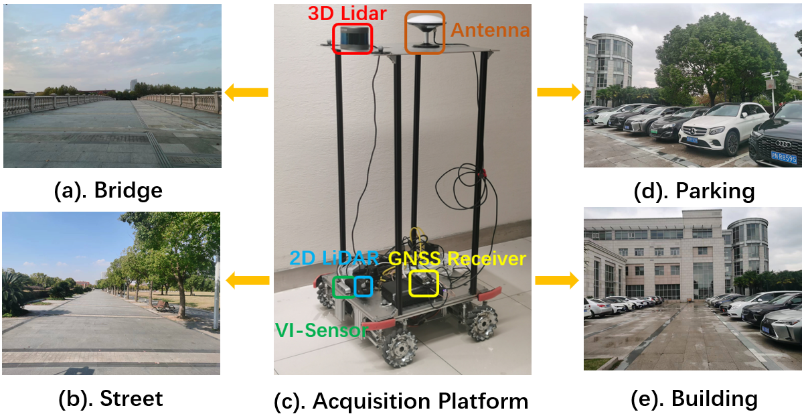

# M2DGR-plus
Extension and update of M2DGR: a novel Multi-modal and Multi-scenario SLAM Dataset for Ground Robots 

## First Author: [Jie Yin](https://github.com/sjtuyinjie?tab=repositories)

Figure 1. Acquisition Platform and Diverse Scenarios.

## NOTICE
### At present all the data are kept private. The full dataset with GT trajectories and calibration results will be made public upon paper acceptance.
If our work is helpful for your research, please follow us and give a star! Feel free to propose issues if you have any questions. The dataset will keep updating.
### We'd consider your suggestions and provide data support for SLAM reseachers as we can to facilitate SLAM progress.

## 1.LICENSE
This work is licensed under MIT license. International License and is provided for academic purpose. If you are interested in our project for commercial purposes, please contact us on 1195391308@qq.com for further communication. 

## 2.SENSOR SETUP

All the sensors and track devices and their most important parameters are listed as below:

* **LIDAR** Robosense 16, 360 Horizontal Field of View (FOV),-30 to +10 vertical FOV,10Hz,Max Range 200 m,Range Resolution 3 cm, Horizontal Angular Resolution 0.2°.  
* **GNSS** Ublox F9p, GPS/BeiDou/Glonass/Galileo, 1Hz  
* **V-I Sensor**,Realsense d435i,RGB/Depth 640*480,69H-FOV,42.5V-FOV,15Hz;IMU 6-axix, 200Hz  
* **IMU**,wheeltec,9-axis,50Hz;  
* **GNSS-IMU** Xsens Mti 680G. GNSS-RTK,localization precision 2cm,100Hz;IMU 9-axis,100 Hz;  
* **Motion-capture System** Vicon Vero 2.2, localization accuracy 1mm, 50 Hz;

The rostopics of our rosbag sequences are listed as follows:

* 3D LIDAR: `/rslidar_points` 

* 2D LIDAR: `/scan` 

* Odom: `/odom` 

* GNSS Ublox F9p:  
`/ublox_driver/ephem `,  

`/ublox_driver/glo_ephem `,

`/ublox_driver/range_meas `,

`/ublox_driver/receiver_lla `,

`/ublox_driver/receiver_pvt `

* V-I Sensor:  
`/camera/color/image_raw`,  
`/camera/imu`

* IMU: `/imu `
 

## 3.DATASET SEQUENCES

Sequence Name|Collection Date|Total Size|Duration|Features|Rosbag|GT
--|:--|:--:|--:|--:|--:|--:
Bridge_01|2022-11-17|2.4g|75s|Bridge, Zigzag|[Rosbag](tbd)|[GT](tbd)
Bridge_02|2022-11-17|16.0g|501s|Bridge, Long-term,Straight line|[Rosbag](tbd)|[GT](tbd)
Street_01|2022-11-17|1.7g|58s|Street, Straight line|[Rosbag](tbd)|[GT](tbd)
Street_02|2022-11-17|3.9g|126s|Bridge, Sharp turn|[Rosbag](tbd)|[GT](tbd)
Parking_01|2022-11-18|3.3g|105s|Parking lot, Side moving|[Rosbag](tbd)|[GT](tbd)
Parking_02|2022-11-18|5.4g|149s|Parking lot, Rectangle loop|[Rosbag](tbd)|[GT](tbd)
Building_01|2022-11-18|3.7g|120s|Building, Far features|[Rosbag](tbd)|[GT](tbd)
Building_02|2022-11-18|3.4g|110s|Building, Far features|[Rosbag](tbd)|[GT](tbd)

## 4. CONFIGURERATION FILES
For convenience of evaluation, we provide configuration files of some well-known SLAM systems as below:

[VINS-Mono](TBD),

[VINS-RGBD](TBD),

[VIW-Fusion](TBD),

[Cartographer](TBD),

[A-LOAM](TBD),

## 5.DEVELOPMENT TOOLKITS
### 5.1 Extracting Images
* For rosbag users, first make image view
~~~
roscd image_view
rosmake image_view
sudo apt-get install mjpegtools
~~~

open a terminal,type roscore.And then open another,type
~~~
rosrun image_transport republish compressed in:=/camera/color/image_raw raw out:=/camera/color/image_raw respawn="true"
~~~
* For non-rosbag users,just take advantage of following script  [export_tum](https://github.com/sjtuyinjie/toolkit/blob/main/export_tum.py),[export_euroc](https://github.com/sjtuyinjie/toolkit/blob/main/export_euroc.py) and [get_csv](https://github.com/sjtuyinjie/toolkit/blob/main/img2csv.py) to get data in formats of Tum or EuRoC.

### 5.2 Evaluation
We use open-source tool [evo](https://github.com/MichaelGrupp/evo) for evalutation.
To install evo,type
~~~
pip install evo --upgrade --no-binary evo
~~~
To evaluate monocular visual SLAM,type
~~~
evo_ape tum street_07.txt your_result.txt -vaps
~~~
To evaluate LIDAR SLAM,type
~~~
evo_ape tum street_07.txt your_result.txt -vap
~~~
To test GNSS based methods,type
~~~
evo_ape tum street_07.txt your_result.txt -vp
~~~

### 5.3 Calibration
For camera intrinsics,visit [Ocamcalib](http://sites.google.com/site/scarabotix/ocamcalib-toolbox) for omnidirectional model.
visit [Vins-Fusion](https://github.com/HKUST-Aerial-Robotics/VINS-Fusion) for pinhole and MEI model.
use [Opencv](https://opencv.org/) for Kannala Brandt model

For IMU intrinsics,visit [Imu_utils](https://github.com/gaowenliang/imu_utils)

For extrinsics between cameras and IMU,visit [Kalibr](https://github.com/ethz-asl/kalibr)
For extrinsics between Lidar and IMU,visit [Lidar_IMU_Calib](https://github.com/APRIL-ZJU/lidar_IMU_calib) 
For extrinsics between cameras and Lidar, visit [Autoware](https://github.com/Autoware-AI/autoware.ai) 

