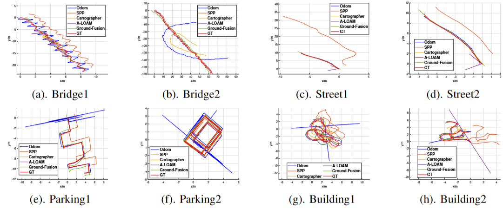

# M2DGR-plus
Extension and update of [M2DGR](https://github.com/SJTU-ViSYS/M2DGR): a novel Multi-modal and Multi-scenario SLAM Dataset for Ground Robots (ICRA2022 & ICRA2024)

## First Author: [Jie Yin](https://github.com/sjtuyinjie?tab=repositories)

Figure 1. Acquisition Platform and Diverse Scenarios.

## NOTICE

### This paper has been accepted by ICRA2024! Feel free to utilize this full dataset to facilitate your research on SLAM. Please give me a star if you like it.

### This dataset is based on [M2DGR](https://github.com/SJTU-ViSYS/M2DGR). And the algorithm code is [Ground-Fusion](https://github.com/SJTU-ViSYS/Ground-Fusion). The preprint version of this paper is [arxiv](http://arxiv.org/abs/2402.14308).

## 1.LICENSE
This work is licensed under MIT license. International License and is provided for academic purpose. If you are interested in our project for commercial purposes, please contact us on 1195391308@qq.com for further communication. 

If you use this work in an academic work, please cite:
~~~
@article{yin2021m2dgr,
  title={M2dgr: A multi-sensor and multi-scenario slam dataset for ground robots},
  author={Yin, Jie and Li, Ang and Li, Tao and Yu, Wenxian and Zou, Danping},
  journal={IEEE Robotics and Automation Letters},
  volume={7},
  number={2},
  pages={2266--2273},
  year={2021},
  publisher={IEEE}
}
~~~

## 2.SENSOR SETUP

The calibration results are [here](https://github.com/SJTU-ViSYS/M2DGR-plus/blob/main/calibration.txt).
All the sensors and track devices and their most important parameters are listed as below:

* **LIDAR** Robosense 16, 360 Horizontal Field of View (FOV),-30 to +10 vertical FOV,5Hz,Max Range 200 m,Range Resolution 3 cm, Horizontal Angular Resolution 0.2°.  
* **GNSS** Ublox F9p, GPS/BeiDou/Glonass/Galileo, 1Hz  
* **V-I Sensor**,Realsense d435i,RGB/Depth 640*480,69H-FOV,42.5V-FOV,15Hz;IMU 6-axix, 200Hz  
* **IMU**,wheeltec,9-axis,100Hz;  
* **GNSS-IMU** Xsens Mti 680G. GNSS-RTK,localization precision 2cm,100Hz;IMU 9-axis,100 Hz;  
* **Motion-capture System** Vicon Vero 2.2, localization accuracy 1mm, 50 Hz;

The rostopics of our rosbag sequences are listed as follows:

* 3D LIDAR: `/rslidar_points` 

* 2D LIDAR: `/scan` 

* Odom: `/odom` 

* GNSS Ublox F9p:  
`/ublox_driver/ephem `,  

`/ublox_driver/glo_ephem `,

`/ublox_driver/range_meas `,

`/ublox_driver/receiver_lla `,

`/ublox_driver/receiver_pvt `

* V-I Sensor:  
`/camera/color/image_raw`,  
`/camera/imu`

* IMU: `/imu `
 

## 3.DATASET SEQUENCES

Sequence Name|Collection Date|Total Size|Duration|Features|Rosbag
--|:--|:--:|--:|--:|--:
Anomaly|2023-8|1.5g|57s|wheel anomaly|[Rosbag](https://sjtueducn-my.sharepoint.com/:u:/g/personal/594666_sjtu_edu_cn/Ef8corMuVwhJsWSpp-FXkREBrTduGBO8nifC9VEb5twHVg?e=CyEeMy)
Switch|2023-8|9.5g|292s|indoor-outdoor switch|[Rosbag](https://sjtueducn-my.sharepoint.com/:u:/g/personal/594666_sjtu_edu_cn/ESRoBZtYjrtAkOzZZZxjtLIBowQqF3G9Vz-jiaUCCy6E_A?e=RtZkwL)
Tree|2023-8|3.7g|160s|Dense tree leave cover|[Rosbag](https://sjtueducn-my.sharepoint.com/:u:/g/personal/594666_sjtu_edu_cn/EV9aZQbxo7pChOxZEWqdP0IBDpySkhtOXNIRKP3ijDK62Q?e=fW0afm)
Bridge_01|2022-11|2.4g|75s|Bridge, Zigzag|[Rosbag](https://sjtueducn-my.sharepoint.com/:u:/g/personal/594666_sjtu_edu_cn/EftDI1uQ_M1Hp4LZVof4sHgB4_IF2C9HBsWYZKAK2mr4EA?e=dydvKz)
Bridge_02|2022-11|16.0g|501s|Bridge, Long-term,Straight line|[Rosbag](https://sjtueducn-my.sharepoint.com/:u:/g/personal/594666_sjtu_edu_cn/EUrTvD2zK2hNimekHiJS5rABME45O5s7ksSAJpd3ipD-BA?e=7aicGk)
Street_01|2022-11|1.7g|58s|Street, Straight line|[Rosbag](https://sjtueducn-my.sharepoint.com/:u:/g/personal/594666_sjtu_edu_cn/Ebap2epwtTtHhWtp0AO_nnYB7S7zDZkkW-zTpYVmrHfOEA?e=JvDij7)
Street_02|2022-11|3.9g|126s|Bridge, Sharp turn|[Rosbag](https://sjtueducn-my.sharepoint.com/:u:/g/personal/594666_sjtu_edu_cn/EdqjNDDhVkJNhwA9DKlPnTsBIXh0xCGITpvQ1b4bG__k0A?e=chWjV8)
Parking_01|2022-11|3.3g|105s|Parking lot, Side moving|[Rosbag](https://sjtueducn-my.sharepoint.com/:u:/g/personal/594666_sjtu_edu_cn/EaCXXT2SAP9AmmqR1LUYwu4By3z5P3jhdeROv8EPdp9C0A?e=fQqJq5)
Parking_02|2022-11|5.4g|149s|Parking lot, Rectangle loop|[Rosbag](https://sjtueducn-my.sharepoint.com/:u:/g/personal/594666_sjtu_edu_cn/EX7UjX535NZBkaXSIX63Pg4BMDGXfIfkjS7JvL-0lUA8mQ?e=lAMTTu)
Building_01|2022-11|3.7g|120s|Building, Far features|[Rosbag](https://sjtueducn-my.sharepoint.com/:u:/g/personal/594666_sjtu_edu_cn/EUqNPeUal1JDnSd9ZbYKo5EBoaQKrna5m23B7LxzAB-mtQ?e=QtWUal)
Building_02|2022-11|3.4g|110s|Building, Far features|[Rosbag](https://sjtueducn-my.sharepoint.com/:u:/g/personal/594666_sjtu_edu_cn/EQcO7OhqhYlCv1tAQJeD6EkBi50Ot3OPajKtZmZJlJFyUw?e=NBS9rs)

## 4. EXPERIMENTAL RESULTS
### We test methods with diverse senser settings to validate our benchmark dataset. Results shown that our dataset is a valid and effective testfield for localization methods.
And in some cases, our Ground-Fusion achieves comparable performance to Lidar SLAM!

Figure 2. The ATE RMSE (m) result on some sequences.

Figure 3. The visualized trajectory.

## 5. Configuration Files
We provide configuration files for several cutting-edge baseline methods, including [VINS-RGBD](https://github.com/SJTU-ViSYS/M2DGR-plus/tree/main/config_files/vinsrgbd),[TartanVO](https://github.com/SJTU-ViSYS/Ground-Challenge/tree/main/config_files_gc/tartanvo),[VINS-Mono](https://github.com/SJTU-ViSYS/M2DGR-plus/tree/main/config_files/vinsmono) and [VIW-Fusion](https://github.com/SJTU-ViSYS/M2DGR-plus/tree/main/config_files/viwfusion) and 
[GVINS](https://github.com/SJTU-ViSYS/M2DGR-plus/tree/main/config_files/gvins).

